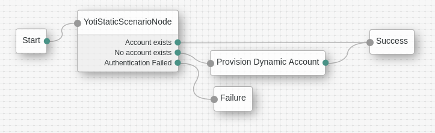
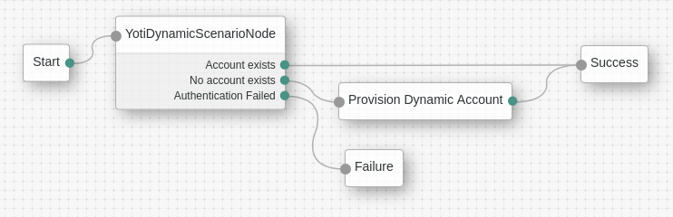

<!--
 * The contents of this file are subject to the terms of the Common Development and
 * Distribution License (the License). You may not use this file except in compliance with the
 * License.
 *
 * You can obtain a copy of the License at legal/CDDLv1.0.txt. See the License for the
 * specific language governing permission and limitations under the License.
 *
 * When distributing Covered Software, include this CDDL Header Notice in each file and include
 * the License file at legal/CDDLv1.0.txt. If applicable, add the following below the CDDL
 * Header, with the fields enclosed by brackets [] replaced by your own identifying
 * information: "Portions copyright [year] [name of copyright owner]".
 *
 * Copyright ${data.get('yyyy')} ForgeRock AS.
-->
# YotiAuthNode

The nodes in this repo demonstrate how ForgeRock's [Identity Platform][forgerock_platform] may be integrated with Yoti's verified Identity Service.

## Deployment

### Quick Start

Use maven to build and package the node as a jar:
```$bash
mvn clean package
```

Then deploy it to the ../web-container/webapps/openam/WEB-INF/lib directory where AM is deployed:
```$bash
cp target/YotiAuthNode-1.0.0-SNAPSHOT-jar-with-dependencies.jar $CATALINA_HOME/webapps/am/WEB-INF/lib/
```

Restart the web container to pick up the new node.  The node will then appear in the authentication trees components palette.

### Build

The code in this repository has binary dependencies that live in the ForgeRock maven repository. Maven can be configured to authenticate to this repository by following the following [ForgeRock Knowledge Base Article](https://backstage.forgerock.com/knowledge/kb/article/a74096897).

## Usage

To use the Yoti Authentication nodes, you will need to have a Yoti Application.  The nodes need to be configured with the AppId, SdkId and the pem file given to you when you creates your Yoti App.

Both demo nodes apply the steps below, the difference between them is the scenario they use:
1. If you are already logged in, you will pass through the node without anything happening
2. If you are not logged in, you will be asked to scan a QR code with your Yoti App
3. After scanning the code you are redirected back to AM's XUI
    1. Your unique ID with Yoti is your rememberMeId.  If a user is found with that Id, you will be logged in to AM
    2. If no user user is found, one will be created in the configured AccountProvider (that's the user repository) 

These nodes are intended for use in ForgeRock _Authentication Trees_.  To test the behaviour of a specific tree, you include a query param named _service_ that gives the name of tree e.g. _?service=MyAuthTree_. 

### Yoti Static Scenario Node

This node will make use of a regular (static) scenario defined for your app in dashboard.  The QR code is displayed to the user using a page hosted by Yoti, the ForgeRock UI redirects to the correct Yoti page using the appId.  After the code has been scanned, the browser is redirected using the _Callback URL_ specified for your scenario in dashboard.

After you've created an App & a Scenario in Yoti dashboard, create a new Authentication Tree in AM's XUI that looks like this:


The _Yoti Static Scenario Node_ must be configured with these properties:

| Configuration | Description |
| --- | --- |
| Key Pair | Full path to the .pem key file you were given by dashboard |
| Yoti client SDK ID | The sdkId you were given for your app on dashboard |
| Application ID | The appId you were given for your app on dashboard |
| Redirect Base URI | The base uri of the page that will display the QrCode |
| Attribute Mappings | Mapping of Yoti Profile attributes to local OpenAM attributes.  If any returned attribute does not have a mapping here, then it simply keeps the attribute name it has. |
| Account Provider | The name of the Java Class that provides an AccountProvider implementation | 

Once your tree is saved, you can try it out by adding the name of your new tree as a query param to the XUI URL, for example [https://yoti.forgerock.demo.com:8443/am/XUI/?service=YoTreeStatic]


### Yoti Dynamic Scenario Node

This node creates a dynamic scenario on the fly.  The QR code is displayed inline, using the browser.js script from 
yoti.com.  There is still a callback url, used when the code has been scanned and the share has been accepted, this time using the app domain specified in Yoti dashboard and a path configured in AM. The path must include a query param that names the tree.

After you've created an App in Yoti dashboard, create a new Authentication Tree in AM's XUI that looks like this:


The _Yoti Dynamic Scenario Node_ must be configured with these properties:

| Configuration | Description |
| --- | --- |
| Key Pair | Full path to the .pem key file you were given by dashboard |
| Yoti client SDK ID | The sdkId you were given for your app on dashboard |
| Application ID | The appId you were given for your app on dashboard |
| Callback URL | The callback _path_ to use in combination with the _Application domain_ from dashboard |
| Yoti browser.js path | The path to the specific version of the _browser.js_ script provided by Yoti |
| Attribute Mappings | Mapping of Yoti Profile attributes to local OpenAM attributes.  If any returned attribute does not have a mapping here, then it simply keeps the attribute name it has. |
| Account Provider | The name of the Java Class that provides an AccountProvider implementation |
| Requested Attributes | The Yoti attribute names of the attributes to request in the share |
| Require Selfie Authentication | Whether the user is required to authenticate themself with a selfie |

Once your tree is saved, you can try it out by adding the name of your new tree as a query param to the XUI URL, for example [https://yoti.forgerock.demo.com:8443/am/XUI/?service=YoTreeDynamic]


## Disclaimer
        
The sample code described herein is provided on an "as is" basis, without warranty of any kind, to the fullest extent permitted by law. ForgeRock does not warrant or guarantee the individual success developers may have in implementing the sample code on their development platforms or in production configurations.

ForgeRock does not warrant, guarantee or make any representations regarding the use, results of use, accuracy, timeliness or completeness of any data or information relating to the sample code. ForgeRock disclaims all warranties, expressed or implied, and in particular, disclaims all warranties of merchantability, and warranties related to the code, or any service or software related thereto.

ForgeRock shall not be liable for any direct, indirect or consequential damages or costs of any type arising out of any action taken by you or others related to the sample code.

[forgerock_platform]: https://www.forgerock.com/platform/  
